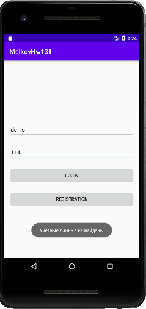

## Задача 1. Сохранение/восстановление текста во внутренний файл
### Описание
Контроль доступа к приложению - важная задача, которая стоит в каждом втором проекте. Разумеется, некоторая информация должна храниться только во внутреннем хранилище приложения (например, платежные данные банковской карты).
### Задание
Создайте экран Логина - Пароля для своего приложения со следующими элементами:
- Edittext для логина.
- Edittext для пароля.
- Кнопка "ОК", по клику на которую приложение проверяет правильность логина - пароля.
Логин и пароль храним во внутреннем файле приложения.

